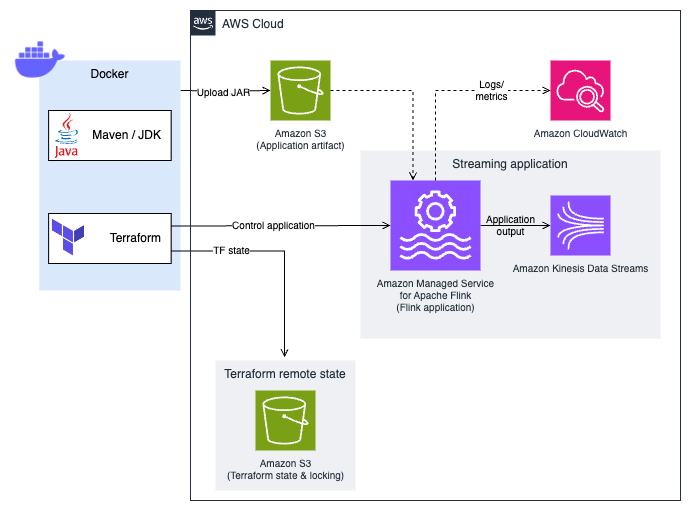

# Amazon Managed Service for Apache Flink Application Lifecycle Management with Terraform

This code sample demonstrates how to use Terraform to control the lifecycle of a Managed Service for Apache Flink application using Docker. The process ensures consistent deployment environments and secure handling of AWS credentials.

## Architecture overview



## Pre-requisites

* [An AWS account](https://console.aws.amazon.com/console/home?nc2=h_ct&src=header-signin)
* [Java 11 or later](https://docs.aws.amazon.com/corretto/latest/corretto-11-ug/downloads-list.html)
* [Apache Maven 3.9.6 or later](https://maven.apache.org/)
* [Docker](https://docs.docker.com/engine/install/) installed and running on your machine 
* [AWS CLI](https://docs.aws.amazon.com/cli/latest/userguide/getting-started-install.html) installed and configured with appropriate [AWS profile](https://docs.aws.amazon.com/cli/v1/userguide/cli-configure-files.html)

The Terraform code in this example only manages the Managed Service for Apache Flink application. Additional resources are required, in the same account and region where you are going to deploy the application. 

These resources must be manually created:
* Kinesis data stream
  * Data stream name: `ExampleOutputStream`
  * Capacity mode: `Provisioned`
  * Number of provisioned shards: 1 or more
* S3 bucket 
  * Stores the application JAR. For simplicity, the same bucket is used to store the Terraform remote state. It is recommended to [enable Bucket Versioning](https://developer.hashicorp.com/terraform/language/backend/s3) on the S3 bucket to allow for state recovery.
* DynamoDB table 
  * Used by Terraform for locking. The primary key must be called `LockID`.

Do not forget to edit the Terraform state backend configuration as described [later](#4-terraform-state-backend) with the bucket name and table name.

## Environment variables

Before starting, ensure you have the following environment variable set:

- `AWS_PROFILE`: Your AWS profile name that contains the necessary credentials

### AWS Region 
This example is designed to be deployed in `us-east-1`. Your AWS profile should match this region. If you choose to use a different region, do not forget to amend the region in the following files:
* `terraform/config.tvars.json`
* `terraform/backend.conf`
* `terraform/variables.tf`

## Getting started

### 1. Clone the repository 

Clone the repository to your desired workspace and move into the repository:

```bash
git clone https://github.com/aws-samples/amazon-managed-service-for-apache-flink-lifecycle-management-terraform.git
```

### 2. Build the Docker image

Build the Docker image by running the following command:

```bash
docker build -t msf-terraform .
```

This command builds a Docker image named `msf-terraform` using the Dockerfile in the current directory. The image contains all necessary dependencies for running Terraform and AWS operations.

### 3. Export the AWS credentials

Make sure to put your correct AWS profile name in `$AWS_PROFILE` and that your profile is authenticated and has sufficient permissions.

Then run the following command to extract the current credentials:

```bash
aws configure export-credentials --profile $AWS_PROFILE --format env-no-export > .env.docker
```

This step:
- Exports AWS credentials from your specified AWS profile
- Saves the temporary credentials in environment variable format to `.env.docker`  that will be used by the Docker container

This workflow ensures secure credential handling without exposing them in the command line.

**Important**: If you authenticate with AWS using temporary credentials, often with corporate SSO, you may need to execute this command again when credentials are renewed.

### 4. Terraform state backend

Amazon S3 is used to store the Terraform state and Amazon DynamoDB for state locking and consistency checking. 

Edit the file  `./terraform/backend.conf`:

```
bucket = "your-s3-bucket-name"
key = "terraform/terraform.tfstate"
region = "us-east-1"
dynamodb_table = "your-dynamodb-table`
```

Replace `your-s3-bucket-name` and `your-dynamodb-table` with the name of the S3 bucket and DynamoDB table you created, and make sure `region` matches the AWS region you are working on.

See [Terraform S3 state backend documentation](https://developer.hashicorp.com/terraform/language/backend/s3) for details.

### 5. Check the config variables

Check the config variables for your Flink application inside `terraform/config.tfvars.json` and change as desired. 

In particular, make sure that the name of the S3 bucket, the Kinesis Stream, and the AWS region match those you are using.

### 6. Run the deployment container

We can now run the deployment.

```bash
docker run --env-file .env.docker --rm -it \
  -v ./flink:/home/flink-project/flink \
  -v ./terraform:/home/flink-project/terraform \
  -v ./build.sh:/home/flink-project/build.sh \
  msf-terraform bash build.sh apply
```

This command:
- Runs the MSF Terraform container with AWS credentials
- Mounts necessary local directories into the container
- Executes the deployment script `build.sh`
- Builds the JAR file of the Flink application, uploads it to Amazon S3 and creates the required AWS resources using Terraform

Note that you have to pass the desired Terraform command at the end of the Docker run command, e.g. `init`, `plan`, `apply` or `destroy`.

### 7. Update the deployment container 

Update a config variable inside `terraform/config.tfvars.json` and simply run: 

```bash
docker run --env-file .env.docker --rm -it \
  -v ./flink:/home/flink-project/flink \
  -v ./terraform:/home/flink-project/terraform \
  -v ./build.sh:/home/flink-project/build.sh \
  msf-terraform bash build.sh apply
```

### 8. Destroy the deployment container and resources  

Run the following command to destroy the created resources: 
```bash
docker run --env-file .env.docker --rm -it \
  -v ./flink:/home/flink-project/flink \
  -v ./terraform:/home/flink-project/terraform \
  -v ./build.sh:/home/flink-project/build.sh \
  msf-terraform bash build.sh destroy
```

Note that you have to destroy your DynamoDB table as well as the S3 separately. 

Run the following command to delete the created Docker image:

```bash
docker image rm msf-terraform
```

## Known simplifications and limitations

This example is for demonstrations purposes and allows you to simulate different phases of the application lifecycle.

For simplicity, both application code, configuration, and Terraform code are in the same repo. 
Also, we have a single build command that build the Flink application, upload a new JAR to S3, and execute Terraform, regardless of the changes.

In a real world CI/CD you probably separate application build and JAR upload, and trigger it only on specific actions (e.g. a Git commit or merge to the application code).

Also, this example uses the build timestamp appended to the JAR file name to "version" it. 
In a real world you should use a JAR naming related to the git commit, or other versioning, that links a unique JAR to a unique state of the code, following any best practices you use for your SDLC.
We recommend not to overwrite the same JAR file, always using the same name.

The example also deliberately hardwires the AWS region to keep the example simple.
The region can be parametrized using some additional parameter and templating mechanism.

## Security

See [CONTRIBUTING](CONTRIBUTING.md#security-issue-notifications) for more information.

## License

This library is licensed under the MIT-0 License. See the LICENSE file. 

## Authors

- [Felix John](https://github.com/Madabaru)
- [Lorenzo Nicora](https://github.com/nicusX)
- [Hamza Khalid](https://github.com/ihamzak)
